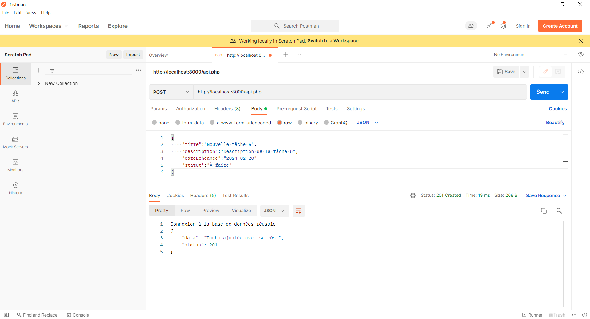

# API de Gestion de Tâches

## Introduction
Ceci est une API simple pour la gestion de tâches. Elle permet d'ajouter, de récupérer, de mettre à jour et de supprimer des tâches.
Vous pouvez recupérer le code souce en clonant le projet à l'aide de l'outil [git](https://git-scm.com/downloads) que vous devrez au préalable installer.
```bash
git clone https://gitlab.com/share2871803/php-rest-api.git
```

## 1. Structure du code et Explication
Examinons en détail chaque partie du code.

### `rest-api/sql/database.sql`
Ce script SQL est utilisé pour créer la base de données et la table nécessaires à l'API de gestion de tâches.

```sql
-- Création de la base de données
CREATE DATABASE IF NOT EXISTS {{databaseName}};

-- Utilisation de la base de données
USE {{databaseName}};

-- Création de la table "taches"
CREATE TABLE IF NOT EXISTS taches (
    id INT AUTO_INCREMENT PRIMARY KEY,
    titre VARCHAR(255),
    description TEXT,
    dateEcheance DATE,
    statut VARCHAR(50)
);
```

- La première partie vérifie si la base de données existe. Si elle n'existe pas, elle est créée.
- La deuxième partie sélectionne la base de données nouvellement créée.
- La troisième partie crée une table appelée "taches" avec les colonnes id (clé primaire), titre, description, dateEcheance et statut.

### `rest-api/config.php`
Ce fichier PHP gère la configuration et la connexion à la base de données.

```php
<?php

// Paramètres de connexion à la base de données
$host = 'localhost'; // Par exemple, 'localhost' si la base de données est sur le même serveur
$utilisateur = 'root';
$motDePasse = 'root';
$nomBaseDeDonnees = 'gestionTaches';

// Chaîne de connexion PDO pour la connexion initiale (sans sélection de base de données)
$dsn = "mysql:host=$host;charset=utf8mb4";

// Options PDO
$options = [
    PDO::ATTR_ERRMODE            => PDO::ERRMODE_EXCEPTION,
    PDO::ATTR_DEFAULT_FETCH_MODE => PDO::FETCH_ASSOC,
    PDO::ATTR_EMULATE_PREPARES   => false,
];

try {
    // Tentative de connexion à MySQL sans sélection de base de données
    $connexion = new PDO($dsn, $utilisateur, $motDePasse, $options);

    // Vérifier si la base de données existe
    $query = $connexion->query("SELECT SCHEMA_NAME FROM INFORMATION_SCHEMA.SCHEMATA WHERE SCHEMA_NAME = '$nomBaseDeDonnees'");
    $databaseExists = ($query->rowCount() > 0);

    // Si la base de données n'existe pas, la créer
    if (!$databaseExists) {
        $connexion->exec("CREATE DATABASE $nomBaseDeDonnees");
        echo "Base de données créée avec succès.\n";
    }

    // Sélection de la base de données
    $dsn = "mysql:host=$host;dbname=$nomBaseDeDonnees;charset=utf8mb4";
    $connexion = new PDO($dsn, $utilisateur, $motDePasse, $options);

    // Afficher un message de réussite en vert
    echo "Connexion à la base de données réussie.\n";
} catch (PDOException $e) {
    // Afficher un message d'échec en rouge
    die("Échec de la connexion à la base de données : " . $e->getMessage() . "\n");
}
```

- Les paramètres de connexion à la base de données, tels que l'hôte, le nom d'utilisateur, le mot de passe et le nom de la base de données, sont définis au début.
- Ensuite, une chaîne de connexion PDO est définie avec des options pour gérer les erreurs et le mode de récupération des résultats.
- Une tentative de connexion à MySQL est effectuée sans sélection de base de données pour vérifier si la base de données existe.
- Si la base de données n'existe pas, elle est créée.
- Enfin, la base de données est sélectionnée, et un message de réussite est affiché.

### `rest-api/migrate.php`
Ce script PHP est utilisé pour exécuter le script SQL de migration, créant ainsi la structure de la base de données.

```php
<?php

// Inclure le fichier de configuration
require_once('config.php');

// Chemin vers le fichier SQL
$sqlFilePath = 'sql/database.sql';

// Lire le contenu du fichier SQL
$sqlContent = file_get_contents($sqlFilePath);

// Remplacer la variable {{databaseName}} par le nom de la base de données
$sqlContent = str_replace('{{databaseName}}', $nomBaseDeDonnees, $sqlContent);

try {
    // Exécuter le script SQL
    $connexion->exec($sqlContent);

    // Afficher un message de réussite en vert
    echo "\033[32mMigration réussie.\033[0m\n";
} catch (PDOException $e) {
    // Afficher un message d'échec en rouge
    die("\033[31mÉchec de la migration : " . $e->getMessage() . "\033[0m\n");
}
```

- Le fichier de configuration est inclus.
- Le chemin du fichier SQL est spécifié, et le contenu est lu.
- La variable `{{databaseName}}` est remplacée par le nom de la base de données défini précédemment.
- Le script SQL est exécuté, et un message de réussite ou d'échec est affiché.

### `rest-api/api.php`
Ce fichier PHP contient l'implémentation principale de l'API de gestion de tâches.

```php
<?php
header("Content-Type: application/json");
require_once('config.php');

// Récupérer la méthode de la requête
$method = $_SERVER['REQUEST_METHOD'];

// Traiter les différentes méthodes
switch ($method) {
    // ... (voir ci-dessous)
}

function response($data, $status) {
    $response['data'] = $data;
    $response['status'] = $status;
    http_response_code($status);
    echo json_encode($response);
    exit;
}
```

Le code principal est organisé autour d'une structure de commutation (`switch`) basée sur la méthode HTTP de la requête. Les principales méthodes supportées sont `POST`, `GET`, `PUT`, et `DELETE`.

#### Traitement de la méthode POST
```php
case 'POST':
    // Ajout d'une nouvelle tâche
    $data = json_decode(file_get_contents("php://input"));
    if (isset($data->titre, $data->description, $data->dateEcheance, $data->statut)) {
        $stmt = $connexion->prepare("INSERT INTO taches (titre, description, dateEcheance, statut) VALUES (:titre, :description, :dateEcheance, :statut)");
        $stmt->bindParam(':titre', $data->titre, PDO::PARAM_STR);
        $stmt->bindParam(':description', $data->description, PDO::PARAM_STR);
        $stmt->bindParam(':dateEcheance', $data->dateEcheance, PDO::PARAM_STR);
        $stmt->bindParam(':statut', $data->statut, PDO::PARAM_STR);

        if ($stmt->execute()) {
            response("Tâche ajoutée

 avec succès.", 201);
        } else {
            response("Échec de l'ajout de la tâche.", 500);
        }
        $stmt->closeCursor(); // Fermer le curseur pour éviter des problèmes potentiels
    } else {
        response("Les données sont incomplètes.", 400);
    }
    break;
```

- La méthode `POST` permet l'ajout d'une nouvelle tâche. Les données JSON de la requête sont décodées.
- Les paramètres requis (titre, description, dateEcheance, statut) sont vérifiés.
- Une requête préparée est utilisée pour insérer les données dans la table "taches".
- La réponse est renvoyée avec un code approprié.

#### Traitement de la méthode GET
```php
case 'GET':
    // Récupération des tâches ou d'une tâche spécifique par ID
    $id = isset($_GET['id']) ? $_GET['id'] : null;

    if ($id !== null) {
        $stmt = $connexion->prepare("SELECT * FROM taches WHERE id = :id");
        $stmt->bindParam(':id', $id, PDO::PARAM_INT);
        $stmt->execute();
        $tache = $stmt->fetch(PDO::FETCH_ASSOC);

        if ($tache) {
            response($tache, 200);
        } else {
            response("Aucune tâche trouvée avec l'ID spécifié.", 404);
        }
    } else {
        // Si aucun ID spécifié, récupérer toutes les tâches
        $stmt = $connexion->query("SELECT * FROM taches");
        $taches = $stmt->fetchAll(PDO::FETCH_ASSOC);
        response($taches, 200);
    }
    break;
```

- La méthode `GET` permet la récupération de toutes les tâches ou d'une tâche spécifique par ID.
- Si un ID est spécifié, une requête préparée est utilisée pour récupérer la tâche correspondante.
- Si aucun ID n'est spécifié, toutes les tâches sont récupérées.
- La réponse est renvoyée avec un code approprié.

#### Traitement de la méthode PUT
```php
case 'PUT':
    // Mise à jour d'une tâche existante
    $id = isset($_GET['id']) ? $_GET['id'] : null;
    $data = json_decode(file_get_contents("php://input"));
    
    if ($id !== null && isset($data->titre, $data->description, $data->dateEcheance, $data->statut)) {
        $stmt = $connexion->prepare("UPDATE taches SET titre = :titre, description = :description, dateEcheance = :dateEcheance, statut = :statut WHERE id = :id");
        $stmt->bindParam(':titre', $data->titre, PDO::PARAM_STR);
        $stmt->bindParam(':description', $data->description, PDO::PARAM_STR);
        $stmt->bindParam(':dateEcheance', $data->dateEcheance, PDO::PARAM_STR);
        $stmt->bindParam(':statut', $data->statut, PDO::PARAM_STR);
        $stmt->bindParam(':id', $id, PDO::PARAM_INT);

        if ($stmt->execute()) {
            response("Tâche mise à jour avec succès.", 200);
        } else {
            response("Échec de la mise à jour de la tâche.", 500);
        }
        $stmt->closeCursor();
    } else {
        response("L'ID ou les données sont incomplètes.", 400);
    }
    break;
```

- La méthode `PUT` permet la mise à jour d'une tâche existante. L'ID de la tâche est extrait de la requête.
- Les données JSON de la requête sont décodées, et les paramètres requis (titre, description, dateEcheance, statut) sont vérifiés.
- Une requête préparée est utilisée pour mettre à jour la tâche dans la table "taches".
- La réponse est renvoyée avec un code approprié.

#### Traitement de la méthode DELETE
```php
case 'DELETE':
    // Suppression d'une tâche existante
    $id = isset($_GET['id']) ? $_GET['id'] : die(response("L'ID de la tâche est requis.", 400));
    $stmt = $connexion->prepare("DELETE FROM taches WHERE id = :id");
    $stmt->bindParam(':id', $id, PDO::PARAM_INT);

    if ($stmt->execute()) {
        response("Tâche supprimée avec succès.", 200);
    } else {
        response("Échec de la suppression de la tâche.", 500);
    }
    $stmt->closeCursor();
    break;
```

- La méthode `DELETE` permet la suppression d'une tâche existante. L'ID de la tâche est extrait de la requête.
- Une requête préparée est utilisée pour supprimer la tâche de la table "taches".
- La réponse est renvoyée avec un code approprié.

#### Fonction `response`
```php
function response($data, $status) {
    $response['data'] = $data;
    $response['status'] = $status;
    http_response_code($status);
    echo json_encode($response);
    exit;
}
```

- La fonction `response` prend des données et un code de statut en entrée, crée un tableau associatif avec ces valeurs, définit le code de statut HTTP, encode le tableau en format JSON, puis affiche la réponse et termine le script.

Cela conclut l'explication détaillée de chaque partie du code de l'API de gestion de tâches.

## 2. Configuration
1. Assurez-vous d'avoir un serveur PHP, MySQL et POSTMAN installé. Je vous recommande ces deux outils :
   - [Laragon](https://laragon.org/)
   - [Postman](https://www.postman.com/)
2. Exécutez le fichier de migration pour créer la base de données et la table nécessaire.

```bash
php migrate.php
```

## 3. Utilisation
   - Démarrez votre serveur, par exemple Wamp, XAMPP, Laragon, etc.
   - Démarrez le serveur intégré de PHP :

```bash
php -S localhost:8000
```

## Exemples d'utilisation

### Ajout d'une Tâche (POST)
   - URL : `http://localhost:8000/api.php`
   - Méthode : `POST`
   - Content-Type : `application/json`
   - Corps de la requête :
```json 
{
    "titre":"Nouvelle tâche",
    "description":"Description de la tâche",
    "dateEcheance":"2024-02-28",
    "statut":"À faire"
}
```

**Réponse :**
```json
{
    "data": "Tâche ajoutée avec succès.",
    "status": 201
}
```


### Récupération des Tâches (GET)
- Pour toutes les tâches :
   - URL : `http://localhost:8000/api.php`
   - Méthode : `GET`

**Réponse :**
```json
{
    "data": [
        {
            "id": 1,
            "titre": "Nouvelle tâche",
            "description": "Description de la tâche",
            "dateEcheance": "2024-02-28",
            "statut": "À faire"
        },
        // ... autres tâches ...
    ],
    "status": 200
}
```


- Pour une tâche spécifique (remplacez `x` par l'ID de la tâche) :
   - URL : `http://localhost:8000/api.php?id=x`
   - Méthode : `GET`

**Réponse :**
```json
{
    "data": {
        "id": 1,
        "titre": "Nouvelle tâche",
        "description": "Description de la tâche",
        "dateEcheance": "2024-02-28",
        "statut": "À faire"
    },
    "status": 200
}
```


### Mise à Jour d'une Tâche (PUT)
- Pour une tâche spécifique (remplacez `x` par l'ID de la tâche) :
   - URL : `http://localhost:8000/api.php?id=x`
   - Méthode : `PUT`
   - Content-Type : `application/json`
   - Corps de la requête :
```json 
{
    "titre":"Nouveau titre",
    "description":"Nouvelle description",
    "dateEcheance":"2024-03-15",
    "statut":"En cours"
}
```

**Réponse :**
```json
{
    "data": "Tâche mise à jour avec succès.",
    "status": 200
}
```


### Suppression d'une Tâche (DELETE)
- Pour une tâche spécifique (remplacez `x` par l'ID de la tâche) :
   - URL : `http://localhost:8000/api.php?id=x`
   - Méthode : `DELETE`

**Réponse :**
```json
{
    "data": "Tâche supprimée avec succès.",
    "status": 200
}
```


## Codes de Statut HTTP
- 200 OK : Requête réussie
- 201 Created : Ressource créée avec succès
- 400 Bad Request : Requête mal formée
- 404 Not Found : Ressource non trouvée
- 500 Internal Server Error : Erreur interne du serveur
- 405 Method Not Allowed : Méthode non autorisée